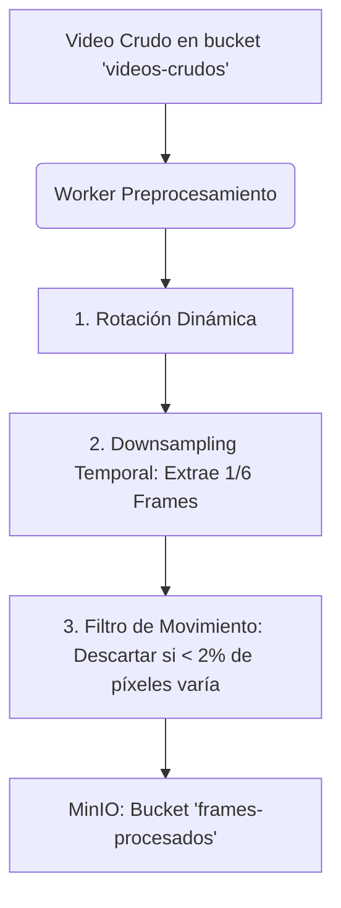
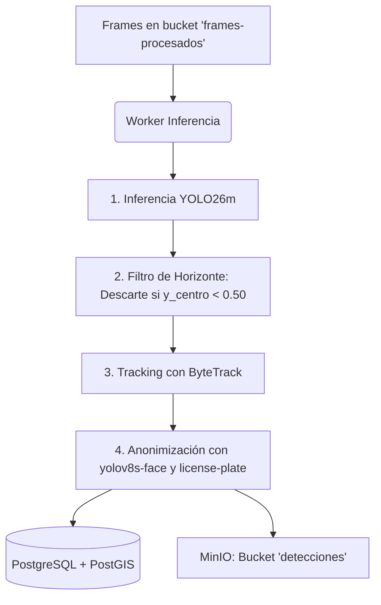
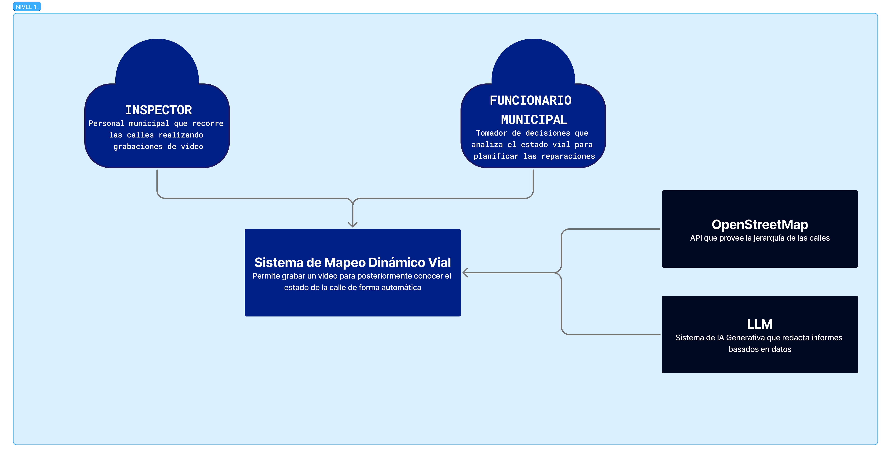
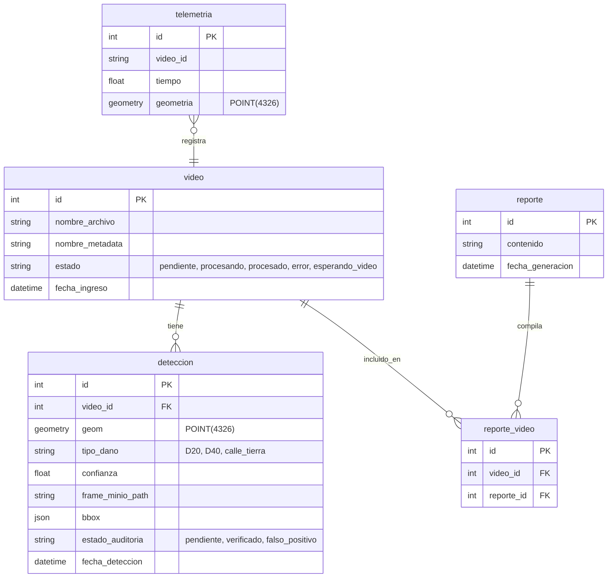

# PICS - Sistema de Mapeo Dinámico Vial: Documentación Técnica Consolidada

Este documento presenta de forma integral y centralizada el diseño, desarrollo, experimentación e implementación del **Sistema de Mapeo Dinámico Vial (PICS)**. Centraliza tanto el análisis de datos y modelado de Machine Learning como la arquitectura de software distribuida en contenedores y su infraestructura de despliegue en la nube.

---

## Tabla de Contenidos

1. [Introducción y Contexto del Proyecto](#1-introducción-y-contexto-del-proyecto)
2. [Los Clientes Web: PozoCam y Dashboard de Monitoreo](#2-los-clientes-web-pozocam-y-dashboard-de-monitoreo)
    * 2.1 [PozoCam: El Cliente Móvil de Captura](#21-pozocam-el-cliente-móvil-de-captura)
    * 2.2 [Dashboard: El Panel de Gestión y Control Municipal](#22-dashboard-el-panel-de-gestión-y-control-municipal)
3. [Arquitectura y Modelado de Datos (Machine Learning)](#3-arquitectura-y-modelado-de-datos-machine-learning)
    * 3.1 [Descripción General del Dataset y el Filtro Anti-Domain Shift](#31-descripción-general-del-dataset-y-el-filtro-anti-domain-shift)
    * 3.2 [Desbalance de Clases y Mitigación de Falsos Positivos](#32-desbalance-de-clases-y-mitigación-de-falsos-positivos)
    * 3.3 [Historial de Experimentos y Comparativa de Modelos](#33-historial-de-experimentos-y-comparativa-de-modelos)
    * 3.4 [Justificación de la Arquitectura (YOLO26 vs. YOLOv8 y RT-DETR)](#34-justificación-de-la-arquitectura-yolo26-vs-yolov8-y-rt-detr)
    * 3.5 [Tabla de Resultados y Métricas Finales](#35-tabla-de-resultados-y-métricas-finales)
4. [Arquitectura del Sistema (Ingeniería de Software)](#4-arquitectura-del-sistema-ingeniería-de-software)
    * 4.1 [Topología de Microservicios (Docker Compose)](#41-topología-de-microservicios-docker-compose)
    * 4.2 [Flujos Críticos de Procesamiento de Video](#42-flujos-críticos-de-procesamiento-de-video)
    * 4.3 [Subida Multipartes de Video (Explicación Sencilla e Ingeniería)](#43-subida-multipartes-de-video-explicación-sencilla-e-ingeniería)
    * 4.4 [Integración Geoespacial y Deduplicación Inteligente](#44-integración-geoespacial-y-deduplicación-inteligente)
    * 4.5 [Filtro de Horizonte (ROI) y Anonimización de Privacidad](#45-filtro-de-horizonte-roi-y-anonimización-de-privacidad)
    * 4.6 [Sembrado de Usuarios por Defecto (Base de Datos)](#46-sembrado-de-usuarios-por-defecto-base-de-datos)
5. [Ciclo de MLOps: Human-in-the-Loop (HITL) y Reentrenamiento](#5-ciclo-de-mlops-human-in-the-loop-hitl-y-reentrenamiento)
    * 5.1 [Lógica de Auditoría Web y Gestión de Buckets](#51-lógica-de-auditoría-web-y-gestión-de-buckets)
    * 5.2 [La Ciencia del Olvido Catastrófico y Estrategias de Mitigación](#52-la-ciencia-del-olvido-catastrófico-y-estrategias-de-mitigación)
6. [Enriquecimiento Urbano e Inteligencia Artificial (Ollama / OpenAI / Gemini)](#6-enriquecimiento-urbano-e-inteligencia-artificial-ollama-openai-gemini)
    * 6.1 [Georreferenciación y Priorización Técnica con OpenStreetMap](#61-georreferenciación-y-priorización-técnica-con-openstreetmap)
    * 6.2 [Decisión del Reporte: Prompt Defensivo y Mitigación de Alucinaciones](#62-decisión-del-reporte-prompt-defensivo-y-mitigación-de-alucinaciones)
    * 6.3 [Flexibilidad de Cómputo e Integración de Proveedores (Ollama / OpenAI / Gemini)](#63-flexibilidad-de-cómputo-e-integración-de-proveedores-ollama-openai-gemini)
7. [Despliegue, Infraestructura Cloud y CI/CD](#7-despliegue-infraestructura-cloud-y-cicd)
    * 7.1 [Configuración de GKE y Cloud SQL](#71-configuración-de-gke-y-cloud-sql)
    * 7.2 [Automatización de CI/CD (GitHub Actions)](#72-automatización-de-cicd-github-actions)
    * 7.3 [Manifiestos y Despliegue en Kubernetes](#73-manifiestos-y-despliegue-en-kubernetes)
8. [Diagramas de Arquitectura C4](#8-diagramas-de-arquitectura-c4)
    * 8.1 [Diagrama de Contexto del Sistema](#81-diagrama-de-contexto-del-sistema)
    * 8.2 [Diagrama de Contenedores C4](#82-diagrama-de-contenedores-c4)
    * 8.3 [Distribución de Módulos del Repositorio](#83-distribución-de-módulos-del-repositorio)
    * 8.4 [Modelo Entidad-Relación de la Base de Datos (DER)](#84-modelo-entidad-relación-de-la-base-de-datos-der)
    * 8.5 [Estructura de Almacenamiento en MinIO (S3 Buckets)](#85-estructura-de-almacenamiento-en-minio-s3-buckets)
9. [Resumen del Ciclo del Dato de Extremo a Extremo (End-to-End)](#9-resumen-del-ciclo-del-dato-de-extremo-a-extremo-end-to-end)
10. [Conclusión Final](#10-conclusión-final)

---

## 1. Introducción y Contexto del Proyecto

La inspección y el mantenimiento de la red vial en los municipios del Conurbano Bonaerense, en particular en el municipio de **Moreno**, enfrenta históricamente serias limitaciones debidas a la lentitud de los relevamientos manuales, la subjetividad en la catalogación del daño y la falta de datos georreferenciados actualizados para la toma de decisiones presupuestarias.

El **Proyecto Integrador de Ciencias de Datos (PICS)** resuelve este desafío mediante el diseño de una plataforma de relevamiento dinámico automatizado de la infraestructura vial. El sistema permite cargar videos continuos capturados a nivel de calle (por ejemplo, desde cámaras montadas en parabrisas de vehículos municipales o de transporte) y, de forma totalmente asíncrona y escalable:

1.  Extrae los fotogramas del video y sincroniza cada frame con su coordenada GPS interpolada.
2.  Ejecuta modelos de Deep Learning para detectar e identificar tres tipos principales de daños en la calzada: **Baches (`D40`)**, **Grietas (`D20`)** y **Calles de Tierra** (claves para planificar obras de pavimentación).
3.  Evita duplicar alertas físicas de un mismo desperfecto mediante una validación geoespacial inteligente basada en distancias lógicas.
4.  Garantiza la privacidad difuminando de forma automática los rostros y patentes que aparecen en las imágenes.
5.  Consolida reportes ejecutivos narrativos utilizando un modelo de lenguaje de gran tamaño (LLM) que prioriza tramos viales según su cercanía a infraestructuras críticas (escuelas, hospitales) e importancia de la vía (rutas, avenidas).
6.  Provee un flujo *Human-in-the-Loop* (HITL) para auditar detecciones y cerrar el ciclo de aprendizaje continuo del modelo de IA sin interrumpir la operación de producción.

---

## 2. Los Clientes Web: PozoCam y Dashboard de Monitoreo

El sistema expone dos interfaces web independientes, diseñadas para cubrir distintos momentos operativos: la recolección en calle y la gestión en oficina.

### 2.1 PozoCam: El Cliente Móvil de Captura
La recolección de datos en calle se ejecuta mediante **PozoCam**, una aplicación web móvil dedicada diseñada para operar sobre parabrisas o tableros de vehículos de inspección municipal.

*   **Grabación Offline con Guardado de Video Local:** Para evitar la pérdida de videos debido a la inestabilidad de la señal móvil 4G/5G en el Conurbano, PozoCam utiliza la librería `localForage`. Los fragmentos grabados de video y la metadata GPS en tiempo real se persisten localmente en la base de datos indexada del navegador (**IndexedDB**). Una vez finalizado el recorrido y recuperada la conectividad estable, el operador puede iniciar la carga segura y finalmente liberar el video grabado.
*   **Captura de Telemetría GPS Sincronizada:** Utiliza la API de geolocalización de HTML5 para registrar las coordenadas (latitud, longitud, velocidad y precisión) a intervalos regulares, construyendo el archivo de metadatos `.json` con marcas temporales relativas en milisegundos (`elapsed_ms`), lo que permite emparejar la posición física con el segundo exacto del video.
*   **Monitoreo de Precisión de Señal GPS (Alta Precisión):** La aplicación móvil configura `enableHighAccuracy: true` para forzar el uso del sensor GPS de hardware del dispositivo móvil. Implementa además un umbral de calidad visual en su HUD para reportar el estado de la señal: se considera **GPS OK** si el margen de precisión (`accuracy`) reportado es estrictamente menor a **20 metros**; caso contrario, se emite una advertencia de **GPS BAJO** (habitual en zonas con alta cobertura forestal o puentes), alertando al operario para que detenga la inspección o revise el hardware.
*   **Carga Directa S3 (Multipart Upload):** Integra la biblioteca de subida `Uppy.js` para segmentar archivos de video de gran tamaño en partes individuales de **5 MB**. Esto reduce significativamente la presión de memoria RAM en el dispositivo móvil y permite reanudar de forma transparente fragmentos que fallaron en el envío.

### 2.2 Dashboard: El Panel de Gestión y Control Municipal
Una vez procesados los datos, los operarios municipales acceden a la interfaz de administración:
*   **Visualización en Mapa Interactivo:** Integra **Leaflet.js** y capas de OpenStreetMap para renderizar todas las fallas físicas detectadas de forma georreferenciada. Los daños se presentan en el mapa y permiten hacer click para abrir un pop-up con la captura fotográfica del daño.
*   **Visualización de Trayectorias de Recorridos:** El mapa consume el endpoint `/api/v1/trayectorias` de la API para recuperar los puntos GPS cronológicos y renderizar el recorrido que realizó el vehículo de inspección. La ruta se grafica mediante una línea discontinua (**Leaflet Polyline**) de color celeste brillante (`#33ccff`), grosor de `2` píxeles y un patrón de guiones `10, 10` (dashArray), lo que permite a los supervisores auditar exactamente qué calles fueron relevadas físicamente.
*   **Identificación y Filtrado Interactivo (Leyendas):**
    *   **Mapeo de Etiquetas Amigables:** Se reemplazaron los códigos técnicos por nombres legibles en la interfaz: `D40` se presenta como **Bache**, `D20` como **Grieta / Fisura** y `calle_tierra` como **Calle de Tierra**.
    *   **Unificación Estética de Colores:** Los marcadores y gráficos en el mapa se unificaron en una paleta de celestes y azules distinguiendo cada tipo de daño:
        *   **Bache (`D40`):** Celeste brillante / eléctrico (`#00b8ff`).
        *   **Grieta / Fisura (`D20`):** Celeste pastel muy claro (`#a3f7ff`).
        *   **Calle de Tierra (`calle_tierra`):** Azul profundo (`#2266ff`).
    *   **Popup de Leyendas Interactivas:** El mapa cuenta con una leyenda flotante explicativa que no solo identifica el tipo de anomalía, sino que permite hacer clic en cada categoría para filtrar dinámicamente y ocultar/mostrar ciertos tipos de detecciones en el mapa.
*   **Control del Umbral de Confianza:** Incluye un control interactivo (slider) en el dashboard que filtra en tiempo real las detecciones visualizadas en el mapa según el nivel de certeza de la predicción. Por ejemplo, al fijar el umbral en 30%, solo se renderizan los daños que posean una confianza mayor o igual al 30%, persistiendo esta preferencia en el `localStorage` del usuario.
*   **Monitoreo del Pipeline de Videos y Panel de Auditoría HITL:** Muestra el listado en tiempo real con el estado de procesamiento de cada video. A su vez, la tarjeta izquierda **DETECCIONES** sirve de panel de control para que los operadores revisen y auditen cada falla como "Verificada" o "Falso Positivo" ( HITL).
*   **Gestión y Consola de Reportes de IA:**
    *   **Tarjetas de Resumen Rápido:** Encabezando el informe de IA, se integraron tarjetas de lectura veloz que sintetizan el estado general de las calles relevadas, el total de baches, grietas y tramos de calzada natural, permitiendo una rápida toma de decisiones.
    *   **Historial de Reportes y Borrado:** Dispone de un panel lateral para navegar por el historial completo de todos los reportes consolidados del sistema. Además, incluye la posibilidad de eliminar reportes antiguos directamente desde la base de datos (con confirmación de SweetAlert en el frontend).
    *   **Cálculo de Tramos Viales:** El backend agrupa las detecciones por video y, mediante geocodificación inversa en OpenStreetMap de las coordenadas de inicio y fin, calcula de forma automatizada los nombres de los tramos viales afectados (ej. "Calle X hasta Calle Y"), mostrándolos en la metadata del reporte.
*   **Chat Interactivo con PozoBot y Streaming:** Permite chatear con el asistente virtual consumiendo el endpoint de `/preguntar`. La API transmite las respuestas en tiempo real mediante *streaming*, permitiendo que el dashboard muestre el texto de forma progresiva a medida que la IA lo genera.
*   **Métricas Municipales:** Se agregó un botón de **Métricas** en la barra superior. Abre un modal con estadísticas clave consolidadas (daños totales, relación de verificados vs falsos positivos) y gráficos de tendencia de anomalías registradas en el último semestre.
*   **Acceso Directo a Logs de FastAPI:** Para usuarios con rol `admin`, se expone un botón **Ver Logs** en la barra de navegación que redirige directamente a la consola de Grafana Loki configurada con filtros específicos para el servicio `api_fastapi`.
*   **Página de Status para Operadores:** El enlace de monitoreo de salud del sistema `/status` (que verifica el estado en tiempo real de FastAPI, PostgreSQL, Redis, MinIO y Ollama) ahora se encuentra habilitado para usuarios con rol `operador`, además de los administradores.


---

## 3. Arquitectura y Modelado de Datos (Machine Learning)

Esta sección recopila el trabajo de modelado de visión computacional y el ciclo de vida del dato detallado en las notebooks de entregables:
*   [01_adquisicion_y_exploracion_inicial.ipynb](https://github.com/LeoKele/PICS_Sistema_de_mapeo_dinamico_vial/blob/main/notebooks/01_adquisicion_y_exploracion_inicial.ipynb)
*   [02_integracion_y_limpieza_datos.ipynb](https://github.com/LeoKele/PICS_Sistema_de_mapeo_dinamico_vial/blob/main/notebooks/02_integracion_y_limpieza_datos.ipynb)
*   [03_analisis_exploratorio.ipynb](https://github.com/LeoKele/PICS_Sistema_de_mapeo_dinamico_vial/blob/main/notebooks/03_analisis_exploratorio.ipynb)
*   [04_1_documentacion_entrenamiento.ipynb](https://github.com/LeoKele/PICS_Sistema_de_mapeo_dinamico_vial/blob/main/notebooks/04_1_documentacion_entrenamiento.ipynb)
*   [04_2_creacion_dataset_mixto_crudo.ipynb](https://github.com/LeoKele/PICS_Sistema_de_mapeo_dinamico_vial/blob/main/notebooks/04_2_creacion_dataset_mixto_crudo.ipynb)

### 3.1 Descripción General del Dataset y el Filtro Anti-Domain Shift
El modelo de visión computacional se alimenta de dos fuentes de datos complementarias:
1.  **Dataset Global (RDD2022):** Contiene miles de imágenes de daños en carreteras de diversos países.
    > Se identificaron tres subconjuntos del dataset global que debían excluirse estrictamente para evitar que la red neuronal asimile perspectivas e iluminaciones artificiales incompatibles con el dominio del proyecto:
    > *   `China_Drone`: Excluido porque presentaba tomas aéreas de drones. La altura y ángulo modificaban las proporciones físicas de las anomalías viales en relación a las cámaras de calle.
    > *   `United_States`: Excluido por utilizar una cámara gran angular panorámica.
    > *   `China_MotorBike`: Excluido debido a que eran capturas de motocicletas apuntando directamente al asfalto, careciendo del contexto vial circundante y la perspectiva del horizonte.
2.  **Dataset Local (Moreno):** Conjunto de imágenes tomadas en la Zona Oeste recopiladas mediante la API de *Mapillary* (plataforma colaborativa tipo Street View). Este dataset es fundamental para adaptar al modelo a la iluminación, la textura de las calles locales, el ancho de vía y los dispositivos de cámara del municipio (reduciendo la brecha de *Domain Shift*).

### 3.2 Desbalance de Clases y Mitigación de Falsos Positivos
La estrategia de curación de datos consistió en:
*   **Filtrado Estricto de Clases:** Reducción a tres clases de interés municipal:
    *   **`D20`:** Grietas longitudinales, transversales y piel de cocodrilo.
    *   **`D40`:** Baches, pozos, deformaciones y descalces de calzada.
    *   **`calle_tierra`:** Tramos viales no pavimentados.
*   **Mitigación de Falsos Positivos:** El exceso de backgrounds iniciales en el dataset global diluía el aprendizaje del modelo. Se limitó de manera controlada el número de imágenes sin etiquetar en el dataset de entrenamiento mixto, manteniendo una proporción adecuada para que la red reduzcza falsos positivos (por ejemplo, ante sombras de árboles).

### 3.3 Historial de Experimentos y Comparativa de Modelos
El desarrollo del modelo de detección vial atravesó tres intentos metodológicos iterativos:

#### Intento 1: Dataset Global y Transfer Learning con Hugging Face
*   **Estrategia:** Se realizó un entrenamiento base de la arquitectura `YOLO26` en su versión *Small* (`yolo26s.pt`) utilizando el dataset global crudo filtrado (~39.000 imágenes). Posteriormente, se aplicó un fine-tuning utilizando el *Dataset Local Moreno V1* (con redimensión estática de Roboflow a 640x640 y Data Augmentation preestablecido). Paralelamente, se evaluó el reentrenamiento de un modelo `YOLOv8` pre-entrenado de Hugging Face entrenado directamente sobre el Dataset Local Moreno V1.
*   **Resultados y Aprendizajes:** El rendimiento fue extremadamente pobre con un `mAP50` inferior a 0.5. El diagnóstico indicó que el dataset global utilizado contenía un exceso masivo de imágenes vacías (backgrounds) que provocaban un fuerte sesgo negativo en la red, atenuando la sensibilidad ante la detección de anomalías.

#### Intento 2: Dataset Mixto V1
*   **Estrategia:** Para corregir la dilución provocada por las imágenes vacías, se filtró el dataset global reteniendo solo imágenes con las etiquetas de interés y una muestra controlada de backgrounds. Estas imágenes se mezclaron directamente con el *Dataset Local Moreno V1* para conformar el *Dataset Mixto V1*. Se entrenó un modelo `YOLO26s` a una resolución estándar de 640x640 píxeles.
*   **Resultados y Aprendizajes:** Se obtuvo una mejora leve en el `mAP50` global (~0.60, con un `mAP50-95` de apenas 0.27). Sin embargo, surgieron dos problemas críticos:
    1.  **Sobreajuste (Overfitting):** El modelo comenzó a memorizar los datos y las curvas de pérdida en validación subían a partir de la época 45. El conflicto procedía de acumular las técnicas de aumento de datos estáticas aplicadas en Roboflow junto con los aumentos dinámicos en caliente de YOLO.
    2.  **Pobre Precisión en Baches (D40):** Los baches que se encontraban a mediana o larga distancia en el horizonte se volvían invisibles o se confundían con parches oscuros a la resolución estándar de 640x640, agravado al aplicar el mosaico de entrenamiento de YOLO.

#### Intento 3: Dataset Mixto V2 y Alta Resolución
*   **Estrategia:** Representa el modelo consolidado en producción. Se implementaron los siguientes cambios clave:
    1.  **Datos Locales Crudos (Raw):** Se eliminó el redimensionamiento estático y el Data Augmentation pre-calculado de Roboflow. Se usaron las capturas locales en su formato original para que el motor de YOLO funcione dinámicamente con los aumentos del entrenamiento.
    2.  **Escalado de Arquitectura:** Se migró del modelo *Small* al modelo **Medium (`yolo26m.pt`)**, ganando profundidad de características y mejorando la discriminación de texturas asfálticas complejas.
    3.  **Entrenamiento a Alta Resolución:** Se duplicó la resolución a **1024px** (`imgsz=1024`), logrando retener suficientes píxeles en baches lejanos.
    4.  **Hiperparámetros Optimizados para Dominio Vial:** Se desactivó el volteo vertical (`flipud=0.0`) dado que el asfalto siempre está abajo. Se redujo el mosaico a `0.5` para proteger objetos pequeños de distorsiones excesivas, y se fijó `hsv_s=0.5` y `hsv_v=0.5` para dar robustez ante variabilidad lumínica (sombras, clima).

### 3.4 Justificación de la Arquitectura (YOLO26 vs. YOLOv8 y RT-DETR)
*   **YOLOv8 (Ultralytics):** Es una arquitectura consolidada en la industria. Ofrece una estabilidad muy alta y está altamente optimizada para despliegues en dispositivos de borde (*edge computing*).
*   **YOLO26 (Evolución de Próxima Generación):** De acuerdo con la documentación de Ultralytics y análisis evolutivos (ver [YOLO26 vs YOLOv8](https://docs.ultralytics.com/compare/yolo26-vs-yolov8), [Ultralytics YOLO26](https://docs.ultralytics.com/models/yolo26#overview) y el paper [Ultralytics YOLO Evolution](https://arxiv.org/abs/2510.09653)):
    *   **Remoción de DFL (Distribution Focal Loss):** YOLO26 elimina la capa DFL en sus cabezas de regresión. DFL predice la regresión de cajas como una distribución de probabilidad general en lugar de una coordenada discreta. Aunque aporta precisión, incrementa notablemente la carga computacional en CPU debido al paso extra de decodificación matemática. Su eliminación simplifica la arquitectura.
        * Al simplificar la forma matemática en la que el modelo calcula las coordenadas de las cajas, se liberan recursos de la CPU. Esto hace al modelo más liviano y veloz sobre computadoras comunes de oficina o servidores que no tienen placas de video caras.
    *   **Inferencia NMS-Free End-to-End:** YOLO26 implementa un diseño de cabezas dual (*Dual-Head Design*) que integra una cabeza **One-to-One** (que genera directamente predicciones finales sin requerir un procesado posterior de supresión de solapamientos) y otra cabeza **One-to-Many** (tradicional YOLO que requiere algoritmo NMS). La cabeza One-to-One elimina la sobrecarga de Non-Maximum Suppression (NMS) en CPU en tiempo de inferencia, suprimiendo un cuello de botella histórico del pipeline de visión computacional.
        *Tradicionalmente, la IA dibuja cientos de rectángulos superpuestos sobre un mismo bache y luego un filtro lento (llamado NMS) descarta los duplicados. YOLO26 aprende a dibujar directamente un único rectángulo limpio sobre el bache desde el primer momento, ahorrando muchísimo tiempo de cómputo en el servidor.
    *   **Aceleración de un 43% en CPU:** Gracias a la remoción de DFL y a la optimización de los bloques del Backbone, YOLO26 provee una velocidad de inferencia un 43% superior a la de generaciones previas al correr sobre arquitecturas de procesador estándar. Esto es ideal para los workers asíncronos distribuidos en nuestro cluster de Kubernetes sin soporte estricto de GPUs dedicadas.
    *   **ProgLoss y STAL:** YOLO26 implementa pérdidas progresivas (*ProgLoss* - Progressive Loss Balancing) y asignación de etiquetas atenta a targets diminutos (*STAL* - Small-Target-Aware Label Assignment), lo cual optimiza el recall de fallas viales pequeñas localizadas en la distancia en el horizonte.
        * Hacen que la red neuronal sea mucho más sensible a los daños pequeños u ocultos lejos de la cámara, permitiendo registrar grietas finas o baches antes de que el vehículo pase sobre ellos.
    *   **MuSGD Optimizer:** Introduce una técnica híbrida inspirada en el entrenamiento de Grandes Modelos de Lenguaje (LLMs) para lograr una convergencia de curvas más rápida y un aprendizaje estable.
        * Es un optimizador inteligente que hace que el modelo aprenda a detectar anomalías en menos épocas de entrenamiento, reduciendo a la mitad los tiempos de desarrollo en la nube.
*   **RT-DETR (Real-Time Detection Transformer):** Se evaluó esta arquitectura basada en Transformers. En las pruebas de validación con nuestro dataset, las métricas finales de detección por clase (Precision, Recall, mAP50 y mAP50-95) resultaron en:
    *   **Global (All):** Precision: 0.670 | Recall: 0.476 | mAP50: 0.551 | mAP50-95: 0.223
    *   **`D20` (Grietas):** Precision: 0.670 | Recall: 0.474 | mAP50: 0.520 | mAP50-95: 0.229
    *   **`D40` (Baches):** Precision: 0.617 | Recall: 0.276 | mAP50: 0.337 | mAP50-95: 0.128
    *   **`calle_tierra`:** Precision: 0.722 | Recall: 0.670 | mAP50: 0.795 | mAP50-95: 0.312

    Al contrastar estos números con las métricas obtenidas por **YOLO** (detalladas abajo), se evidenció que el modelo YOLO provee un desempeño superior en la detección de fallas viales para nuestro caso de estudio, por lo que fue seleccionado para el pipeline de producción final.

### 3.5 Tabla de Resultados y Métricas Finales
Las siguientes métricas detallan el rendimiento del modelo final de producción (**YOLO26m** con el **Dataset Mixto V2 Crudo** a **1024px**), extraídas directamente de las bitácoras del notebook [04_1_documentacion_entrenamiento.ipynb](https://github.com/LeoKele/PICS_Sistema_de_mapeo_dinamico_vial/blob/main/notebooks/04_1_documentacion_entrenamiento.ipynb):

| Clase / Target | Imágenes (Validación) | Instancias | Precisión (P) | Recall (R) | mAP50 | mAP50-95 |
| :--- | :---: | :---: | :---: | :---: | :---: | :---: |
| **Global (All)** | 1155 | 1582 | **0.782** | **0.686** | **0.719** | **0.339** |
| **`D20` (Grietas)** | 711 | 920 | 0.746 | 0.588 | 0.671 | 0.320 |
| **`D40` (Baches)** | 373 | 631 | 0.647 | 0.469 | 0.493 | 0.203 |
| **`calle_tierra`** | 31 | 31 | 0.954 | 1.000 | 0.992 | 0.493 |

#### Análisis Crítico de los Resultados:
*   **Grietas (`D20`):** Con un mAP50 de 0.671 y precisión de 74.6%, el modelo demuestra una notable robustez para detectar un daño típicamente difícil debido a la similitud de las grietas con líneas de alquitrán o sombras del asfalto.
*   **Baches (`D40`):** El recall del 46.9% indica que el modelo es marcadamente conservador y deja pasar baches reales. Esto ocurre por la extrema similitud visual con manchas de humedad, sombras o sectores oscuros de asfalto. El modelo prioriza la Precisión (evitar falsas alarmas, logrando un 64.7% de precisión en este subconjunto) sobre el Recall, lo cual previene la saturación del sistema en el MVP.
*   **Calles de Tierra (`calle_tierra`):** El rendimiento de ~0.992 de mAP50 y Recall de 1.0 está estadísticamente inflado debido a la fácil discriminación visual (abarca todo el fotograma) y una muestra reducida en validación (31 instancias), por lo que no refleja la complejidad real en el Conurbano.

---

## 4. Arquitectura del Sistema (Ingeniería de Software)

Esta sección describe la ingeniería del backend y la orquestación de servicios asíncronas contenida en el repositorio `pics_proyecto`, cuyo archivo de configuración principal es `docker-compose.yml`.

### 4.1 Topología de Microservicios (Docker Compose)
El sistema utiliza una arquitectura distribuida basada en contenedores aislados:
*   **API Gateway (FastAPI):** Expone la interfaz interactiva REST. Gestiona la carga de videos, telemetría, consultas espaciales en la base de datos, endpoints de auditoría y la conexión con Ollama.
*   **Cola de Tareas (Redis):** Broker de mensajería en memoria para orquestar la comunicación de tareas pesadas entre la API y los workers distribuidos.
*   **Worker de Preprocesamiento:** Script en Python encargado de la decodificación de video, rotación dinámica y filtrado por movimiento.
*   **Worker de Inferencia:** Script en Python encargado de la ejecución del modelo YOLO26m, censura de datos personales y seguimiento.
*   **Geodatabase (PostgreSQL + PostGIS):** Almacenamiento relacional extendido con capacidades espaciales (puerto `5433`). Almacena la telemetría e indexa las geometrías de las fallas detectadas para realizar consultas GIS de proximidad.
*   **Object Storage (MinIO S3):** Servidor local compatible con S3 (puertos `9000/9001`). Almacena los videos crudos (`.webm`), metadatos `.json`, y los fotogramas recortados de las detecciones viales.
*   **Local LLM Service (Ollama):** Ejecuta de forma totalmente privada el modelo local `llama3.2:3b` para compilar reportes ejecutivos narrativos a partir de las detecciones georreferenciadas.
*   **Observabilidad (Grafana + Loki + Promtail):** Centralización y monitoreo de logs de todos los servicios Docker en tiempo real para facilitar la trazabilidad técnica en desarrollo y producción.

### 4.2 Flujos Críticos de Procesamiento de Video

El procesamiento de los datos de video y telemetría sigue un flujo estructurado y asíncrono para prevenir la saturación de los componentes de la API:

#### Pipeline del Worker de Preprocesamiento


#### Pipeline del Worker de Inferencia


#### Helpers de Calidad de Imagen (Pre-filtrado)
El worker de preprocesamiento posee funciones de control de calidad de fotogramas basadas en OpenCV (actualmente implementadas en `worker/preprocesamiento.py` pero inactivas en el bucle principal):
*   **Detector de frames borrosos (`es_imagen_borrosa`):** Calcula la varianza del Laplaciano sobre la imagen en escala de grises. Si la varianza es menor a `30.0`, determina que la imagen está movida/borrosa (debido a la velocidad del vehículo o vibración de la cámara) y puede descartarse.
*   **Detector de frames oscuros (`es_imagen_oscura`):** Evalúa el brillo promedio de la escala de grises. Si es menor a `15.0`, concluye que las condiciones de iluminación son insuficientes (relevamiento nocturno o lente obstruido) y se descarta.

### 4.3 Subida Multipartes de Video (Explicación Sencilla e Ingeniería)

#### La Explicación Sencilla (Analogía)
> **La Analogía del Libro:**
> Mandar un archivo de video muy pesado (como los grabados por PozoCam en alta resolución) a través de una red móvil inestable en Moreno en una sola conexión, es como intentar mandar un libro gigante por correo metido en una sola caja muy pesada. Si en la mitad del viaje el camión choca o hay una tormenta (se corta internet), el libro se destruye y el remitente tiene que volver a mandar el libro completo desde la página uno.
>
> Con **Subida Multipartes (Multipart Upload)**, dividimos el libro en capítulos independientes (bloques de 5 MB). Enviamos cada capítulo por separado. Si hay interferencia y se daña el capítulo 5, el remitente solo vuelve a enviar ese capítulo 5, no todo el libro. Al final, el destinatario (el servidor de base de datos de objetos MinIO) junta todos los fragmentos en orden, reconstruye el archivo de video original y avisa a la API que el material está listo.

#### El Mecanismo de Ingeniería
El flujo se expone a través de tres endpoints dentro de la API FastAPI:
1.  **Inicialización (`POST /api/v1/videos/upload/iniciar`):** El cliente declara el archivo. La API inicializa la sesión en el Object Storage (usando `create_multipart_upload` de la SDK de AWS/MinIO) y retorna un `upload_id`.
2.  **Firmado de Partes (`POST /api/v1/videos/upload/firmar-parte`):** El cliente solicita URLs firmadas temporales para cada bloque de bytes de 5 MB. El servidor genera una firma para el método de S3 `upload_part`.
3.  **Subida directa:** El navegador realiza un `PUT` directo de cada chunk al puerto de MinIO, reduciendo la carga del backend de FastAPI.
4.  **Consolidación y Carga de Telemetría (`POST /api/v1/videos/upload/finalizar`):** El cliente envía el listado de bloques (`ETags`) junto con los datos de telemetría GPS. FastAPI consolida el archivo final en el bucket, persiste el JSON de telemetría y encola la tarea en Redis.

#### Solución a Bloqueos de CORS y Mixed Content (Netlify Redirects)
Dado que los frontends se sirven bajo `HTTPS` en la red de Netlify y el backend de desarrollo en GCP opera temporalmente bajo `HTTP`, el navegador bloquearía la comunicación por directivas de **Mixed Content** y **CORS** (especialmente en la subida binaria `PUT` directa de chunks hacia MinIO).
Para solucionar esto, se implementaron reglas de redirección en Netlify (`_redirects` en la carpeta `/public` del frontend) que actúan como proxy inverso:
*   `/api/*` se mapea a `http://34.63.158.31:8000/api/:splat` (API de FastAPI).
*   `/minio/*` se mapea a `http://35.194.31.183:9000/:splat` (Object Storage de MinIO).
En el cliente de subida (`uploader.ts`), las firmas devueltas por MinIO que apuntan directamente a su IP/Puerto absoluto se reemplazan dinámicamente con la ruta del proxy local `/minio/` para engañar de forma segura al navegador y saltear los bloqueos sin sobrecargar la API de FastAPI.

### 4.4 Integración Geoespacial y Deduplicación Inteligente
La telemetría y la persistencia geoespacial de anomalías viales se controlan combinando la indexación geoespacial en base de datos y el motor de tracking visual de YOLO:
*   **Filtro de Geofencing Municipal (Moreno):** Antes de persistir cualquier dato, el worker valida la coordenada mediante la regla `esta_en_moreno()`. Si el auto cruzó a distritos colindantes, se descarta el procesamiento de ese frame. Los límites lógicos son:
    *   **Norte:** Latitud $\ge -34.5400$
    *   **Sur:** Latitud $\le -34.7600$
    *   **Oeste:** Longitud $\ge -58.8900$
    *   **Este:** Longitud $\le -58.7250$
*   **Sincronización Telemetría-Video:** El archivo `.json` de metadatos del video contiene puntos GPS con marcas de tiempo (`elapsed_ms`). Para asociar una coordenada a un daño específico, el worker lee la marca temporal (`tiempo_ms`) grabada en el nombre del frame e interpola de forma lineal la coordenada geográfica más próxima a dicho segundo exacto de grabación.
*   **Deduplicación Espacial Inteligente (PostGIS):** Para evitar que el sistema guarde múltiples registros del mismo bache físico a lo largo de frames sucesivos, el worker ejecuta una validación híbrida:
    1.  *Deduplicación Visual:* Si el motor **ByteTrack** retiene el mismo identificador visual (`track_id`) ya guardado en la base de datos para ese video, el worker no duplica el registro, sino que actualiza el frame y su nivel de confianza.
    2.  *Deduplicación Geográfica:* Si el tracking visual se interrumpe (debido al tráfico u oscilaciones de la cámara), el worker invoca la función de PostGIS `ST_DWithin` para comprobar si ya se registró una falla de la misma categoría en un radio de tolerancia adaptado al tamaño de cada anomalía:
        *   **3 metros** para baches (`D40`).
        *   **10 metros** para piel de cocodrilo (`D20`).
        *   **30 metros** para calles de tierra (`calle_tierra`).
        Si coincide en distancia, se asigna el nuevo track al registro espacial existente, unificando la detección física.
*   **Fotograma Óptimo e Inferencia Limpia:** Al procesar detecciones continuas de un mismo daño, el sistema compara el nivel de confianza de la predicción. Si la nueva detección supera en confianza a la guardada anteriormente, se actualizan las coordenadas y se ejecuta un proceso de limpieza de disco (*Garbage Collection*) que elimina automáticamente el archivo anterior de MinIO, conservando únicamente la captura de mejor calidad visual.

### 4.5 Filtro de Horizonte y Anonimización de Privacidad
*   **Filtro de Horizonte:** Para descartar falsos positivos en el cielo, árboles o postes de luz, el worker descarta de inmediato cualquier bounding box cuyo centroide vertical esté por encima de la mitad de la imagen (`y_centro < alto_imagen * 0.50`), acotando el análisis a la calzada.
*   **Anonimización Automática:** Antes de persistir y recortar la imagen anotada del daño en MinIO, el módulo anonimizador procesa de forma secuencial dos modelos YOLO especializados sobre el frame original:
    1.  [`yolov8s-face-lindevs.pt`](https://github.com/lindevs/yolov8-face) para detectar rostros humanos.
    2.  [`license-plate-finetune-v1s.pt`](https://github.com/morsetechlab/Yolov11-License-Plate-Detection/tree/main) para patentes de vehículos.
    Cualquier caja detectada por estos dos modelos es difuminada aplicando un filtro de **desenfoque gaussiano** fuerte con un kernel de `(51, 51)` directamente sobre la imagen que se almacena en el bucket de detecciones de MinIO, garantizando la anonimización de datos de terceros.

### 4.6 Sembrado de Usuarios por Defecto (Base de Datos)
Para simplificar la inicialización del sistema en despliegues locales y cloud, el backend de la API implementa un sembrador automático de base de datos (`api/main.py`). En el arranque, comprueba la existencia de registros en la tabla `usuarios` y, si se encuentra vacía, inyecta por defecto dos perfiles iniciales con contraseñas hasheadas en SHA-256:
*   **Perfil Administrador:** Usuario `admin` / Contraseña `admin` (rol `admin`). Otorga acceso total, incluyendo el monitoreo de Grafana Loki y las métricas avanzadas.
*   **Perfil Operario:** Usuario `operador` / Contraseña `operador` (rol `operador`). Otorga acceso a las tareas de auditoría de fallas, visualización del mapa interactivo y la consola de reportes.

---

## 5. Ciclo de MLOps: Human-in-the-Loop (HITL) y Reentrenamiento

Este ciclo cierra la brecha entre la detección del modelo y el aprendizaje continuo, implementado a lo largo de la API de backend, el frontend y la notebook [06_reentrenamiento_human_in_the_loop.ipynb](https://github.com/LeoKele/PICS_Sistema_de_mapeo_dinamico_vial/blob/main/notebooks/06_reentrenamiento_human_in_the_loop.ipynb).

### 5.1 Lógica de Auditoría Web y Gestión de Buckets
1.  **Auditoría en Frontend:** El panel web permite a los inspectores auditar cada alerta detectada por el modelo, clasificándola con dos estados: `verificado` (daño real confirmado) o `falso_positivo` (error del modelo).
2.  **API FastAPI:** El endpoint de auditoría recibe el cambio de estado. Si se audita como `falso_positivo`, el backend:
    *   Copia la imagen original limpia (sin anotaciones de bounding box) al bucket `backgrounds-reentrenamiento` de MinIO.
    *   Elimina la imagen activa del bucket principal de `detecciones`.
    *   Actualiza el estado en PostgreSQL a `falso_positivo` para excluir la anomalía de los reportes automatizados y mapas de calor.

### 5.2 La Ciencia del Olvido Catastrófico y Estrategias de Mitigación
De acuerdo con la investigación en MLOps (ver [The Science of Catastrophic Forgetting and How Fine Tuning Triggers It](https://medium.com/@thekzgroupllc/the-science-of-catastrophic-forgetting-and-how-fine-tuning-triggers-it-45d5e5ddb8b2)), al realizar fine-tuning con conjuntos de datos pequeños (como la acumulación periódica de auditorías), ocurre un desvío de representación (*representation drift*). Las neuronas del backbone reescriben drásticamente sus pesos matemáticos para ajustarse a las nuevas texturas locales del lote, destruyendo los extractores de características genéricos de asfalto y daños aprendidos previamente en el dataset masivo.

Para mitigar este olvido en el reentrenamiento automatizado en Google Colab:
1.  **Datos de Reproducción (Replay Data):** Las nuevas imágenes de baches confirmados y falsos positivos se mezclan con una proporción representativa (10-20%) del dataset de Moreno original para que el optimizador conserve el historial.
2.  **Inyección de Fondos Auditados (Backgrounds):** Las imágenes marcadas como `falso_positivo` se inyectan en el entrenamiento con archivos de anotación de texto vacíos. Esto le enseña a YOLO que texturas específicas de sombras urbanas y parches húmedos no contienen ningún daño.
3.  **Congelamiento de Capas (Layer Freezing):** Se congelan las primeras 10 capas del modelo (`freeze=10`) durante las primeras épocas de ajuste, garantizando que el *Backbone* mantenga estables sus habilidades generales y forzando a que la adaptación ocurra estrictamente en el *Head* (capas de predicción final).
4.  **Tasa de Aprendizaje Conservadora:** Se restringe la tasa de aprendizaje inicial a `lr0=0.001` para evitar descalibrar el conocimiento previo de la red mediante gradientes excesivamente amplios.

---

## 6. Enriquecimiento Urbano e Inteligencia Artificial (Ollama / OpenAI / Gemini)

El sistema no se limita a ubicar puntos en un mapa, sino que convierte los datos geoespaciales estructurados en reportes semánticos inteligentes utilizando un selector de LLM dinámico que soporta proveedores locales y en la nube.

### 6.1 Georreferenciación y Priorización Técnica con OpenStreetMap
*   **Agrupamiento Espacial:** Las coordenadas individuales de las fallas se agrupan espacialmente a tramos de calle usando el algoritmo de clusterización `ST_ClusterDBSCAN` de PostGIS con un radio de tolerancia de **5 metros** (resolución angular de `0.00005` grados) para calcular el centroide geográfico de cada desperfecto real.
*   **Enriquecimiento Geográfico (OpenStreetMap):** Mediante `api/services/geo_service.py`, se realiza una consulta inversa para obtener la denominación de la arteria vial y la proximidad a Puntos de Interés (POIs) críticos como escuelas, centros de salud u hospitales a menos de 50 metros.
*   **Mecanismo de Consulta Inversa con Doble Fallback:** El resolvedor de nombres de calles se comunica con dos proveedores externos para asegurar la continuidad del servicio:
    1.  **Photon por Komoot (`https://photon.komoot.io`):** Cliente primario de consulta rápida sin límites estrictos de tasa.
    2.  **Nominatim OpenStreetMap (`https://nominatim.openstreetmap.org`):** Cliente secundario de respaldo en caso de desconexión o latencia alta del primero.
*   **Caché de Coordenadas por Redondeo Espacial:** Dado que los frames del video son continuos y físicamente adyacentes, realizar llamadas de red en cada segundo causaría un bloqueo inmediato por *Rate Limiting*. El resolvedor trunca y redondea la posición GPS a **3 decimales** (margen de ~100 metros) y almacena los resultados en diccionarios en memoria (`_cache_osm_nombres` y `_cache_osm_contexto`). Si la nueva coordenada cae en el mismo radio mapeado, la respuesta se entrega de forma inmediata (en menos de 1 ms), mitigando la latencia y protegiendo el consumo del API.
*   **Score de Prioridad Técnica:** Se calcula un puntaje matemático automatizado para priorizar la urgencia de bacheo/pavimentación en cada tramo:
    $$\text{Score} = \left( \text{daños\_totales} + 3\text{ (si calle\_tierra)} + 5\text{ (cercanía a POIs)} \right) \times 1.5\text{ (si es Ruta/Avenida)}$$

### 6.2 Decisión del Reporte: Prompt Defensivo y Mitigación de Alucinaciones
Para asegurar que el modelo de lenguaje genere un informe ejecutivo útil, formal y alinear con los datos reales de la base de datos sin alucinar, se implementaron técnicas de **Prompt Defensivo** compatibles con todos los proveedores de LLM:
*   **Regla de Ocultamiento de Métricas:** Se prohíbe explícitamente el uso de las palabras "Score", "Puntaje" o números decimales en el reporte final. El score sirve únicamente para priorizar el ordenamiento estructurado del texto de mayor a menor urgencia, ocultando la métrica cuantitativa interna a fin de ofrecer una redacción orgánica de carácter ejecutivo.
*   **Restricción del Vocabulario de Obra Pública:** Se instruye al modelo a utilizar descripciones formales ("tramos de calzada natural/tierra") y se le prohíbe escribir el conteo directo genérico en su formato crudo (ej: "3 calle tierra").
*   **Justificación Contextual por POI:** El prompt defensivo obliga al modelo a que cada propuesta de bacheo urgente esté justificada citando el POI circundante real detectado (ej: Escuela, Hospital). Esto previene que el LLM invente justificaciones abstractas.
*   **Prompting del Asistente Vial (`/preguntar`):** En `api/routers/video.py` se implementa un prompt maestro estructurado para restringir las interacciones conversacionales, prohibiendo responder preguntas ajenas al dominio de infraestructura vial y obligando al asistente a responder con un saludo fijo determinista ante aperturas informales de chat.

### 6.3 Flexibilidad de Cómputo e Integración de Proveedores (Ollama / OpenAI / Gemini)
El backend implementa un conector dinámico configurable mediante variables de entorno en el archivo `.env`:
*   **Soporte de Gemini SDK (Recomendado para Producción):** El backend se integra directamente con el SDK de Gemini. Si se detecta la variable `GEMINI_API_KEY` en el archivo `.env`, el sistema utiliza **Gemini** (por defecto `gemini-2.5-flash`) a través del endpoint de compatibilidad con OpenAI provisto por Google AI Studio. Las credenciales de API Key se pueden crear y obtener desde la plataforma [Google AI Studio](https://aistudio.google.com/).
*   **Soporte de OpenAI:** Opcionalmente, se puede utilizar la API de OpenAI configurando `LLM_PROVIDER=openai` y proveyendo una `OPENAI_API_KEY` en el archivo `.env`.
*   **Soporte Local con Ollama:** En caso de no proveer APIs en la nube, el sistema ejecuta de forma local y privada el modelo `llama3.2:3b` mediante contenedores con la temperatura fijada en `0.1` para asegurar predictibilidad y un estricto seguimiento de instrucciones.
*   **Pruebas en Infraestructura Externa:** Además de la ejecución local o en Google Cloud Platform (GCP), la portabilidad del backend nos permitió evaluar de forma exitosa el sistema con un clúster de Kubernetes externo provisto por la cátedra, simplemente redirigiendo el endpoint de Ollama.


---

## 7. Despliegue, Infraestructura Cloud y CI/CD

La migración a la nube e infraestructura de Google Cloud Platform (GCP) se encuentra configurada en el directorio `pics_proyecto/k8s`.

### 7.1 Configuración de GKE y Cloud SQL
*   **Google Kubernetes Engine (GKE):** Se implementó un Cluster Kubernetes Estándar en la región `us-central1-a` configurando máquinas `e2-standard-4` (4 CPUs, 16 GB de RAM) para alojar el consumo del modelo YOLO.
*   **Cloud SQL (PostgreSQL 17):** Instancia administrada de base de datos relacional con capacidades de PostGIS habilitadas.
    > **Nota sobre Seguridad en Desarrollo:** En la configuración del entorno inicial, se autorizó la red `0.0.0.0/0` para habilitar conexiones directas sencillas desde el exterior hacia el motor de base de datos de Cloud SQL sin configurar VPC Peering. Esta práctica presenta serios riesgos de seguridad de red y debe ser deshabilitada en producción, configurando una red privada dentro de la nube o usando Cloud SQL Auth Proxy para denegar accesos públicos directos, de todas maneras, para esta instancia del proyecto consideramos que esta simplificación es válida para avanzar.

### 7.2 Automatización de CI/CD (GitHub Actions)
El repositorio de la arquitectura de software cuenta con un pipeline de CI/CD automatizado configurado a través de GitHub Actions en el directorio `.github/workflows/`:
*   `deploy-api.yml`: Se activa al detectar cambios en el directorio `api/` de la rama `main`.

#### Flujo de Ejecución del Pipeline:
1.  **Checkout de Código:** Descarga el código actualizado al entorno virtual de GitHub Actions.
2.  **Autenticación en GCP:** Utiliza `google-github-actions/auth@v2` cargando la llave secreta `GCP_CREDENTIALS` (Service Account con rol de GKE Admin).
3.  **Configuración de Credenciales de Docker:** Ejecuta `gcloud auth configure-docker` vinculándose con el servidor regional de Google Artifact Registry (`us-central1-docker.pkg.dev`).
4.  **Generación de Tag de Versión:** Construye las imágenes Docker utilizando el tag automático basado en los 7 caracteres iniciales del commit SHA (`v-${GITHUB_SHA::7}`).
5.  **Build & Push:** Compila las imágenes utilizando los Dockerfiles y las publica en el repositorio remoto en la nube.
6.  **Despliegue Continuo (Rolling Update):** Conecta con el clúster GKE usando `google-github-actions/get-gke-credentials@v2` y ejecuta `kubectl set image` para actualizar las imágenes activas en los contenedores del cluster de GKE sin caída del servicio.

### 7.3 Auto-escalado Basado en Eventos (KEDA)
La arquitectura cuenta con un sistema de escalado dinámico para los nodos de procesamiento (workers), implementado a través de KEDA (Kubernetes Event-driven Autoscaling).

Este componente monitorea en tiempo real las colas de mensajes en Redis y ajusta la cantidad de pods necesarios, optimizando el consumo de recursos. Se encuentra configurado en el archivo `k8s/keda-workers.yaml`:

Cuando el sistema no registra videos pendientes en la base de datos en memoria, KEDA reduce la cantidad de pods de los workers a cero réplicas, eliminando por completo el consumo de CPU y memoria innecesario.

* **Worker de Preprocesamiento**: Configurado mediante un ScaledObject que monitorea la longitud de la clave cola_preprocesamiento en Redis. Escala dinámicamente de 0 a 3 réplicas máximas (a razón de 1 pod por cada tarea en cola).

* **Worker de Inferencia**: Configurado mediante un ScaledObject que monitorea la longitud de la clave cola_inferencia en Redis. Escala dinámicamente de 0 a 4 réplicas máximas (a razón de un 1 pod por cada tarea en cola).


### 7.4 Manifiestos y Despliegue en Kubernetes
El despliegue de la infraestructura está modulado en archivos YAML localizados en el directorio `pics_proyecto/k8s/`:
*   `01-secretos.yaml`: Almacena de forma codificada las credenciales de base de datos y llaves de MinIO.
*   `02-minio.yaml`: Despliega el almacenamiento de objetos y sus servicios.
*   `03-redis.yaml`: Configura el backend de colas de mensajes de Redis.
*   `04-ollama.yaml`: Levanta el contenedor de Ollama y provee el volumen para almacenar `llama3.2:3b`.
*   `05-api.yaml`: Despliega los pods de la API FastAPI y los asocia a un balanceador de carga externo.
*   `06-workers.yaml`: Configura la escala de réplicas de los Workers de preprocesamiento e inferencia.
*   `07-frontend.yaml`: Sirve el dashboard e interfaz web interactiva del sistema.
*   `08-grafana.yaml`: Habilita el visualizador de telemetría y logs recolectados por Loki.
*   `keda-workers.yaml`: Permite el auto-escalado basado en eventos dinamicos de los nodos de procesamiento.

---

## 8. Diagramas de Arquitectura C4

Para facilitar la comprensión visual de los límites del sistema y la orquestación de datos de producción, se dispone de los diagramas del modelo C4 en la carpeta local de imágenes:

### 8.1 Diagrama de Contexto del Sistema
Representa cómo interactúan los actores externos (inspectores municipales, vehículos en relevamiento) con la API de PICS y las integraciones geográficas de OpenStreetMap.



### 8.2 Diagrama de Contenedores C4
Detalla la estructura interna de los contenedores Docker en producción, mostrando cómo se orquestan la base de datos PostGIS, la cola Redis, MinIO S3 y los workers asíncronos para procesar las detecciones.


### 8.3 Distribución de Módulos del Repositorio
Para garantizar la escalabilidad y la portabilidad del entorno (GCP/Local), la solución de software se divide en los siguientes directorios clave:

*   `api/`: Contiene el Gateway RESTful construido en FastAPI, incluyendo esquemas de validación de datos (Pydantic), ORM de tablas (SQLAlchemy) y la lógica de endpoints para subidas, reportes y Q&A con Ollama.
*   `worker/`: Aloja la lógica de procesamiento asíncrono en segundo plano (Workers de preprocesamiento y de inferencia/censura YOLO) y los pesos de los modelos de visión viales y de privacidad.
*   **[pics_frontend_pozocam](https://github.com/LeoKele/pics_frontend_pozocam)** (Repositorio externo): Código cliente web optimizado para smartphones que realiza grabación de video offline, geolocalización y subida multipartes.
*   **[pics_frontend_dashboard](https://github.com/LeoKele/pics_frontend_dashboard)** (Repositorio externo): Dashboard de administración web municipal integrado con Leaflet.js para la auditoría (HITL) y consulta cartográfica de reportes.
*   `k8s/`: Manifiestos declarativos YAML para el despliegue administrado en la nube (GKE).
*   `observabilidad/`: Configuraciones de Promtail para recolectar y centralizar los logs del sistema.

### 8.4 Modelo Entidad-Relación de la Base de Datos (DER)
Para dar soporte a la deduplicación espacial y la persistencia de datos, se estructuró el siguiente esquema de base de datos relacional con extensiones espaciales:



#### Descripción General de las Tablas:
*   **`video`:** Almacena los metadatos generales y el estado de procesamiento de cada video registrado por el cliente PozoCam (por ejemplo, `pendiente`, `procesando`, `procesado` o `error`).
*   **`deteccion`:** Contiene el inventario de las anomalías viales halladas por la red YOLO (baches, grietas, etc.), indexando sus coordenadas geoespaciales (PostGIS) y guardando el estado de la auditoría manual (*Human-in-the-Loop*).
*   **`telemetria`:** Registra las coordenadas GPS crudas del vehículo a lo largo de las marcas de tiempo del video, permitiendo interpolar con exactitud la ubicación real del daño.
*   **`reporte`:** Almacena el cuerpo narrativo del informe ejecutivo municipal consolidado, redactado de forma privada por el modelo LLM local (Ollama).
*   **`reporte_video`:** Tabla intermedia que asocia N videos a M reportes, permitiendo generar resúmenes consolidados de múltiples recorridos municipales.


### 8.5 Estructura de Almacenamiento en MinIO (S3 Buckets)
El almacenamiento persistente y temporal se distribuye en cuatro buckets específicos dentro del Object Storage:

*   `videos-crudos/`: Almacena temporalmente los videos completos subidos por PozoCam en formato `.webm` junto con sus metadatos `.json` de GPS.
*   `frames-procesados/`: Bucket intermedio que contiene los frames individuales rotados y filtrados (1 de cada 6) generados por el worker de preprocesamiento, listos para la inferencia.
*   `detecciones/`: Contiene exclusivamente los recortes fotográficos de anomalías confirmadas o pendientes de auditoría y anonimizados.
*   `backgrounds-reentrenamiento/`: Repositorio donde se alojan de forma limpia (sin marcas de IA) las imágenes marcadas como falsos positivos para realimentar el pipeline de MLOps.

---

## 9. Resumen del Ciclo del Dato de Extremo a Extremo (End-to-End)

Para entender cómo opera el sistema de forma integrada, a continuación se describe el ciclo que recorren los datos desde el bache físico en Moreno hasta el panel del intendente:

```
[ Bache Físico en Moreno ]
           │
           ▼
1. CAPTURA (PozoCam) ────────► Graba video .webm + coordenadas GPS en la base IndexedDB del móvil.
           │
           ▼
2. SUBIDA (Multipart) ───────► Al recuperar señal, divide el video en partes de 5MB y lo sube a MinIO.
           │                   Envía las coordenadas de telemetría a la API FastAPI.
           ▼
3. PROCESAMIENTO (Workers) ──► El Worker Preprocesamiento reduce frames y quita duplicados.
           │                   El Worker Inferencia ejecuta YOLO26m, censura caras y patentes y asocia GPS.
           ▼
4. DEDUPLICACIÓN (PostGIS) ──► PostGIS comprueba si el bache ya existe en un radio de 3 metros.
           │                   Si es un daño repetido, actualiza la foto si tiene mayor confianza.
           ▼
5. PRIORIZACIÓN E IA ────────► DBScan agrupa daños. Se consulta a OSM calles y escuelas cercanas.
           │                   Ollama (Llama 3.2) redacta un informe y prioriza las reparaciones.
           ▼
6. GESTIÓN (Dashboard) ──────► El inspector ve el mapa, audita errores y chatea con la IA.
```

---

## 10. Conclusión Final

El **Sistema de Mapeo Dinámico Vial (PICS)** representa una solución tecnológica robusta, modular y de alto valor técnico para la modernización de la gestión urbana en municipios locales. La unificación de modelos de visión computacional de frontera como `YOLO26m` con bases de datos espaciales y servicios de procesamiento distribuido demuestra que es factible automatizar el relevamiento de daños de la calzada de forma eficiente y económica.

El desacoplamiento de la inferencia pesada en workers asíncronos coordinados mediante colas de Redis, la resiliencia offline del cliente PozoCam mediante IndexedDB, y el resguardo de la privacidad de los transeúntes (censura de rostros y patentes) proveen una línea de base en ingeniería de software lista para producción. Asimismo, la integración local y privada de Ollama y la arquitectura de MLOps con un ciclo interactivo de *Human-in-the-Loop* (HITL) garantizan que el sistema no solo detecte problemas viales en tiempo real, sino que aprenda de sus propios errores de manera continua y compile informes ejecutivos listos para la toma de decisiones, todo en un entorno totalmente administrado en la nube de Google Cloud Platform y Kubernetes.
