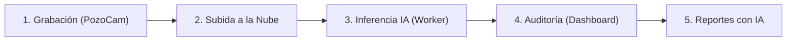

# Manual de Usuario - Sistema de Mapeo Dinámico Vial (PICS)

Este manual detalla paso a paso cómo interactuar con el sistema de detección y auditoría de fallas viales para el Municipio de Moreno, cubriendo tanto la recolección en calle mediante **PozoCam** como el análisis en la oficina a través del **Dashboard de Gestión**.

---

## Flujo General del Sistema
El funcionamiento del sistema se divide en tres fases consecutivas y automáticas:

---

## Fase 1: Recolección en Calle con PozoCam

La aplicación móvil **PozoCam** funciona como los "ojos" del sistema. Está diseñada para usarse desde el parabrisas de vehículos municipales durante sus recorridos habituales.

*   **URL de Acceso:** [`https://pozocam.netlify.app/`](https://pozocam.netlify.app/)

### 1. Configuración Recomendada de la Cámara
Antes de iniciar la grabación, acceda al panel de **Configuración** en la aplicación y verifique los siguientes ajustes:
*   **Selección de Cámara:** Seleccione la cámara trasera con **lente normal / estándar** (no utilice la cámara gran angular ni otras lentes auxiliares para no distorsionar las detecciones de la IA).
*   **Resolución:** Seleccione siempre **Full HD (16:9 - 1080p)**.
*   **Calidad de Video (Bitrate):** Se recomienda calidad **Alta**, aunque puede configurarse en **Media** si desea ahorrar espacio de almacenamiento en el dispositivo.
*   **Servidor API:** Deje este campo **vacío** para que el sistema utilice automáticamente el servidor backend configurado en la nube.

### 2. Iniciar Inspección (Modo Grabación)
1. Coloque el smartphone en un soporte en el parabrisas asegurando una **visión despejada de la calzada**.
2. Abra el enlace en el navegador del dispositivo y pulse **"Iniciar Grabación"**.
3. El sistema comenzará a grabar video en tiempo real mientras sincroniza cronológicamente la telemetría GPS del dispositivo.

> **Resiliencia Offline:** Si circula por zonas sin señal de internet, no se preocupe. La aplicación guardará el video y las coordenadas automáticamente en el almacenamiento local del navegador.

### 3. Finalizar y Subir los Datos
1. Al concluir el recorrido, pulse **"Detener Grabación"**.
2. Al retornar al playón municipal o detectar una conexión Wi-Fi estable, pulse **"Subir Video"**.
3. El archivo se subirá al servidor en la nube de forma segura y fraccionada (**Subida Multipartes**). Si la conexión oscila o se corta temporalmente, la app reanudará la subida exactamente desde donde quedó al recuperar señal.

---

## Fase 2: Auditoría y Gestión en el Dashboard

Una vez procesado el video por el motor de IA en la nube, los datos quedan consolidados en el centro de control del municipio.

*   **URL de Acceso:** [`https://pics-dashboard.netlify.app/`](https://pics-dashboard.netlify.app/)
*   **Credenciales por Defecto (Prueba):**
    *   **Usuario:** `admin`
    *   **Contraseña:** `admin`

### 1. Mapa Central e Inspección de Recorridos
*   **Líneas de Trayectoria:** El mapa dibuja líneas discontinuas celestes que muestran exactamente las calles recorridas por los vehículos de inspección.
*   **Pines de Detección:** Los pines en el mapa indican la ubicación geográfica de las anomalías detectadas (como baches, grietas o calles de tierra).

### 2. Panel Lateral de FotoDetección
Al hacer clic sobre cualquier pin del mapa, el lateral derecho mostrará los metadatos específicos del daño:
*   **Imagen con Lupa Interactiva:** Mueva el cursor sobre la foto para hacer zoom óptico en tiempo real y analizar detalles.
*   **Recuadro Turquesa (BBox):** La IA encuadra la anomalía detectada.
*   **Metadatos Sociales:** Muestra el Tipo de daño, Confianza de la IA, Ubicación (Calle) e intersección más cercana, y la Fecha de captura.

> **Acciones de Auditoría (Human-in-the-Loop):**
> Como operador, puede auditar las detecciones del modelo de IA con dos botones:
> *   **Verificar:** Confirma el daño. Cambiará el estado de la anomalía a "verificado" y mantendrá el pin en el mapa.
> *   **Falso Positivo:** Descarta la anomalía. Quita el pin del mapa y traslada la imagen al bucket de reentrenamiento para mejorar la precisión del modelo en futuras actualizaciones.

### 3. Filtros Interactivos y Umbral de Confianza
*   En la barra superior del Dashboard, puede ajustar el **Umbral de Confianza** mediante un slider deslizante.
*   Esto filtra dinámicamente y en tiempo real las marcas en el mapa y las estadísticas según la precisión requerida (ej. ver solo anomalías detectadas con más del 80% de certeza).
*   También puede activar o desactivar capas específicas (ej. ocultar grietas y ver únicamente baches).

### 4. Estado del Sistema y Monitoreo
*   Desde el panel de administración y los endpoints de monitoreo, se pueden visualizar las métricas clave de rendimiento, los logs activos del backend y el estado de salud de los servicios en la nube para garantizar el correcto funcionamiento del sistema.

---

## Fase 3: Análisis y Reportes con Inteligencia Artificial

### 1. Generación Automática de Reportes Técnicos
1. Pulse el botón **"Generar Reporte"** en la barra lateral del Dashboard.
2. Seleccione de la lista los videos/recorridos que desea incluir.
3. Pulse **"Generar Reporte de Inspección"**.
4. La IA analizará la densidad de baches, la cercanía espacial con **Puntos de Interés (escuelas, hospitales)** y la jerarquía vial (Avenidas/Rutas) para redactar en segundos un informe de prioridades técnicos y formales en formato PDF.

### 2. Conversación con PozoBot (Asistente Vial)
En la parte inferior de la pantalla, dispone del chat interactivo **PozoBot**:
*   Puede preguntarle cosas generales sobre todo el municipio (ej. *"¿Cuántos baches hay en total?"*) o enfocar sus sensores en un video específico seleccionándolo en el Dashboard.
*   **PozoBot** utilizará las herramientas de geocodificación inversa de OpenStreetMap y el resumen técnico para responderle exactamente en qué calles están los problemas críticos y justificar su urgencia.
